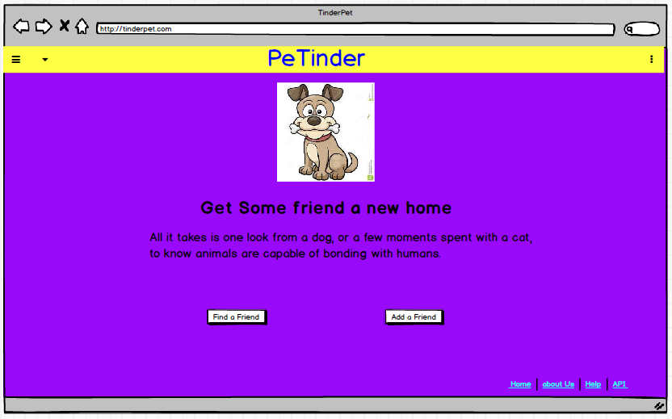
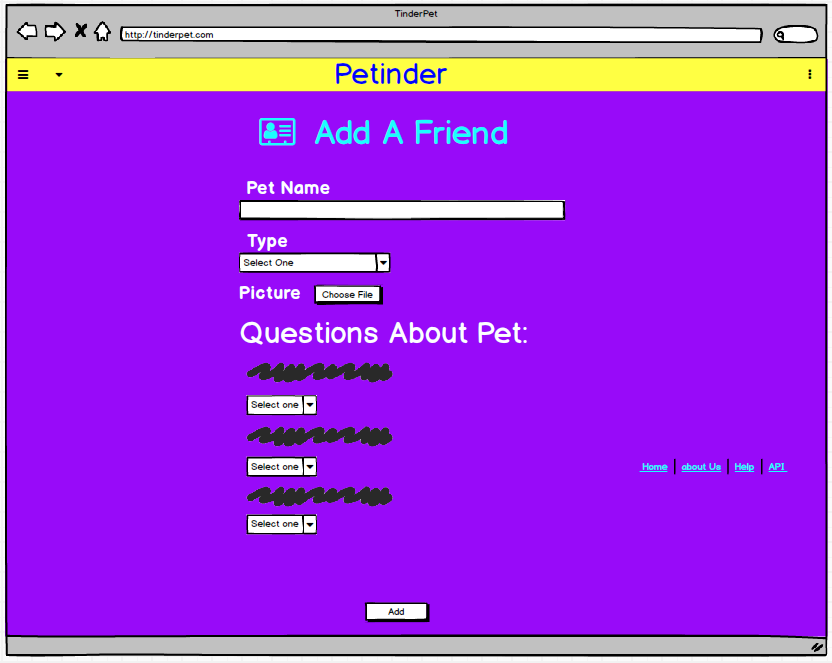
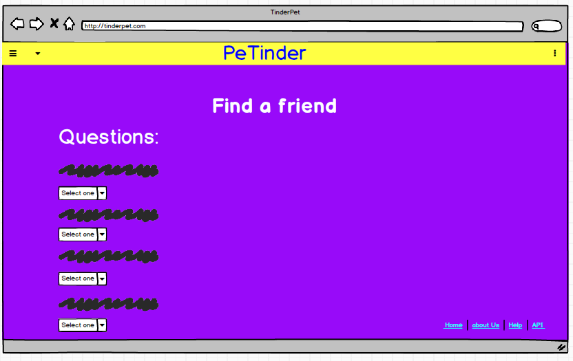
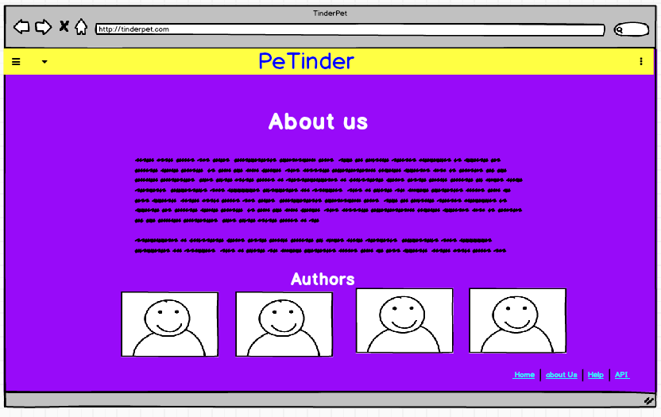

<!-- https://support.squarespace.com/hc/en-us/articles/206543587-Markdown-cheat-sheet -->

# **<h1 style="color:blue;"> 🐶 PeTinder </h1>**

> "The human-animal bond is a mutually beneficial and dynamic **relationship** between people and animals that is influenced by behaviors essential to the health and wellbeing or both.
> This includes, among other things, emotional, psycological and physical interactions of people, animals and enviroment"

### Objective:

- 🐷 This application will target people that are searching for a pet.
- 🐵 It will help users to find a pet based on their profile through a questionary.
- 🐴 Our goal its reduce the numbers of animals on shelters.
- 🐹 It will also provide an API with all availables pet on the database.

### Motivation:

- We are building this app for anyone that likes animals and would like to find the best match.
- The human-animal bond is a mutually beneficial and dynamic relationship between people and animals that is influenced by behaviors considered essential to the health and well-being of both. The bond includes, but is not limited emotional, psychological, and physical interactions of people, animals, and the environment.

### Authors:

- [Adriano Alves](https://github.com/adliano)
- [Jose Menis](https://github.com/josemenis)
- [Karina Lowell](https://github.com/karilowell)
- [Yousef Aldalaeen](https://github.com/Aldalaeen)

### Technology Used:

- [Bootstrap](https://getbootstrap.com/)
- [Nodejs](https://nodejs.org/en/)
- [Expressjs](https://expressjs.com/)
- [Mysql Database](https://www.mysql.com/)
- [Knexjs](https://knexjs.org/)
- [Heroku](https://www.heroku.com/)
- [Multer](https://www.npmjs.com/package/multer)

# UI

